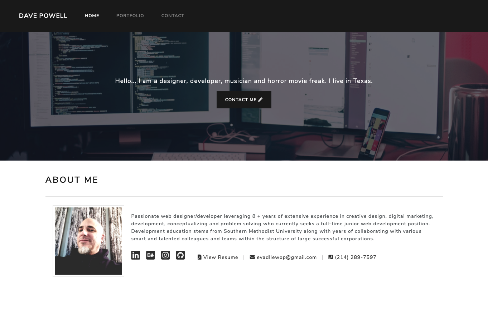

# BootstrapPortfolio

CSS and Bootstrap Portfolio Site

This portfolio is responsive and includes sematic html for accessability. No extra media inquiries were implemented.

# Pages

About Me
Portfoilio
Contact

# Social Media

I have included links to the following:

LinkedIn
Behance
Instagram

# Extra

Hero section that was created with a Jumbotron and then customized

Font Awesome icon in primary "Contact Me" button

Comments dipicting each main section in HTML and CSS files

# Link to deployed site

https://evadllewop.github.io/BootstrapPortfolio/

# Screenshot of deployed site

